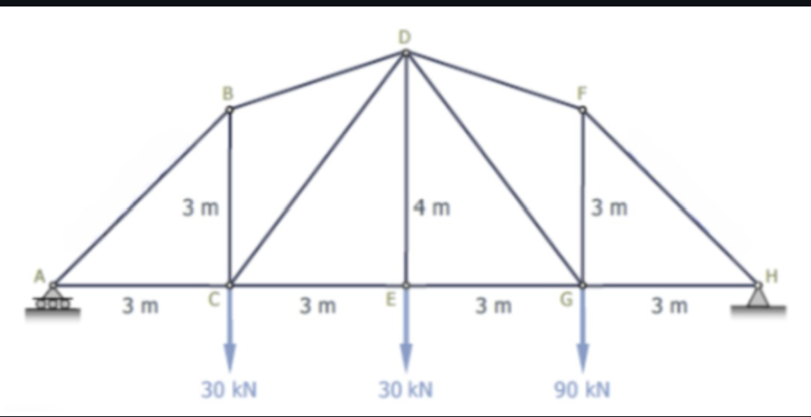
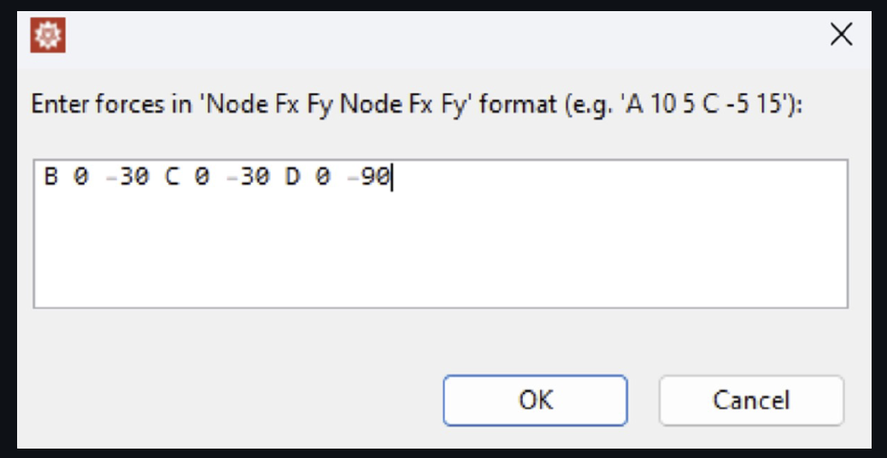
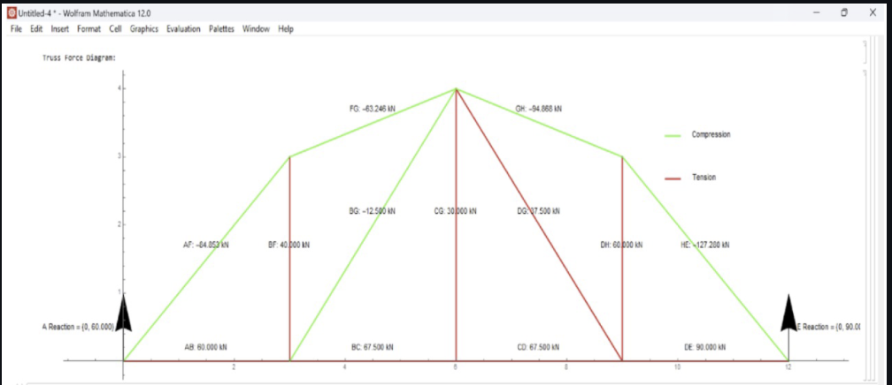

# 🏗️ Truss Analysis Tool — Group 05 (ES221 Project)

## 📖 Overview
This project showcases a computational tool designed to analyze **2D truss structures**, developed under *ES221: Mechanics of Solids* at IIT Gandhinagar.  
The solver, created in **Wolfram Mathematica**, determines internal member forces and produces visualizations of the truss with **color-coded diagrams** for easy interpretation.  

---

## 👥 Team Members
- Anuj Manoj Joshi (23110033)  
- Chaudhari Sarvesh Pravin (23110076)  
- Jatin Agarwal (23110147)  
- Tanushka Anand Sonde (23110332)  
- Yug Mitulkumar Desai (23110730)  

---

## 📝 Problem Statement
Develop a framework to analyze a **statically determinate fixed truss** subjected to user-specified loads. The solver should:  
- Evaluate support reactions  
- Compute internal axial forces (tension and compression)  
- Provide a graphical representation of force distribution across the truss  

---

## 🎯 Objectives
- Perform truss analysis using:
  - Equilibrium equations  
  - Method of joints  
- Enable user-defined load inputs  
- Distinguish and categorize forces (tension vs compression) automatically  
- Generate a clear graphical output with labels and magnitude details  

---

## 🔬 Methodology

### 1. Truss Definition
Nodes and members are pre-configured to ensure geometric accuracy of the structure.  

---

### 2. User Input
Users can input external loads at chosen nodes in a straightforward text format.  

---

### 3. Equilibrium Analysis
- Support reactions are determined using ΣFx=0, ΣFy=0, ΣM=0  
- Internal forces are solved via the **Method of Joints**  

---

### 4. Force Classification
- 🔴 Red → Members in tension  
- 🔵 Blue → Members in compression  
- ⚫ Black → Members carrying negligible force  

---

### 5. Visualization
The tool outputs an annotated truss diagram indicating support reactions, force magnitudes, and directions.  

---

## 📂 Files Included

| File | Description |
|------|-------------|
| `Truss_Solver.nb` | Mathematica notebook with the complete solver code |
| `Project_Report.pdf` | Technical report with methodology, assumptions, analysis, and results |
| `MOS_GROUP-05_Presentation.pdf` | Project presentation summarizing the main visuals and outcomes |

---

## 📊 Results Snapshot
Sample output of calculated member forces (kN):  

| Member | Force (kN) | Type |
|--------|------------|------|
| FAB    | 60.0       | Tension |
| FGH    | 94.87      | Compression |
| FDE    | 90.0       | Tension |

---

## ✅ Outcomes
- Confirmed solver accuracy through both manual calculations and symbolic methods  
- Delivered an interactive tool useful for learning and analysis  
- Improved understanding of structural analysis concepts and computational modeling  

---

## 📚 References
- [Mathalino — Truss by Method of Joints](https://mathalino.com/reviewer/engineering-mechanics/truss-analysis-method-joints)

---
